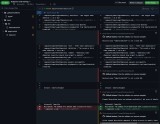

# fhir-ig-action


[](https://github.com/qligier/fhir-ig-action/blob/main/CHANGELOG.md)

This action provides the following functionality for [GitHub Actions](https://docs.github.com/en/actions) users:

- Build a FHIR® Implementation Guide with the [_IG Publisher_](https://github.com/HL7/fhir-ig-publisher/).
- Use the set versions of the [_IG Publisher_](https://github.com/HL7/fhir-ig-publisher/) and
  [_SUSHI_](https://github.com/FHIR/sushi) (if needed).
- Matches _IG Publisher_ and _SUSHI_ errors in _GitHub_, to easily spot issues:
  [](.github/problem_matcher.png)
  See also the live example of a [failing pull request](https://github.com/qligier/simple-test-ig/pull/1/files).

## Usage

The action can be configured with the following inputs:

<dl>
<dt>ig-publisher</dt>
<dd>The version of the _IG Publisher_ to use. The value can be a full version (i.e. <em>x.y.z</em>) or the keyword 
'<strong>latest</strong>'. The default value is '<em>latest</em>'.</dd>

<dt>sushi</dt>
<dd>The version of _SUSHI_ to use. The value can be a partial or full version (i.e. <em>x</em>, <em>x.y</em> or 
<em>x.y.z</em>), the keyword '<strong>latest</strong>', or the keyword '<strong>false</strong>' to disable _SUSHI_. The 
default value is '<strong>false</strong>'.</dd>
</dl>

### Examples

The following example will build an Implementation Guide with the latest version of the _IG Publisher_, without
_SUSHI_. The _ig.ini_ file is expected in the top directory of the project.

```yaml
name: Build the IG
on: [push, pull_request]
jobs:
  test:
    runs-on: ubuntu-latest
    steps:
      - uses: actions/checkout@v4
      - uses: qligier/fhir-ig-action@v0.3.0
```

Another example for a _SUSHI_ Implementation Guide, with specific versions:

```yaml
name: Build the IG
on: [push, pull_request]
jobs:
  test:
    runs-on: ubuntu-latest
    steps:
      - uses: actions/checkout@v4
      - uses: qligier/fhir-ig-action@v0.3.0
        with:
          ig-publisher: "1.6.25"
          sushi: "3.11.1"
```

To build an Implementation Guide in another directory, you should use the
[working-directory](https://docs.github.com/en/actions/using-workflows/workflow-syntax-for-github-actions#jobsjob_idstepsrun)
configuration:

```yaml
name: Build the IG
on: [push, pull_request]
jobs:
  test:
    runs-on: ubuntu-latest
    steps:
      - uses: actions/checkout@v4
      - uses: qligier/fhir-ig-action@v0.3.0
        working-directory: ./folder/my-ig # This will use ./folder/my-ig/ig.ini
```

## License

This project is released under the [MIT License](https://github.com/qligier/fhir-ig-action/blob/main/LICENSE.txt).

## Development

Issues and pull requests are very welcome :blue_heart:

Code contributions must pass the code checks: [shfmt](https://github.com/patrickvane/shfmt),
[ShellCheck](https://www.shellcheck.net) and [Prettier](https://prettier.io). See the
[GitHub Action file](https://github.com/qligier/fhir-ig-action/blob/main/.github/workflows/verify.yml) for details.


_FHIR® is the registered trademark of HL7 and is used with the permission of HL7._
